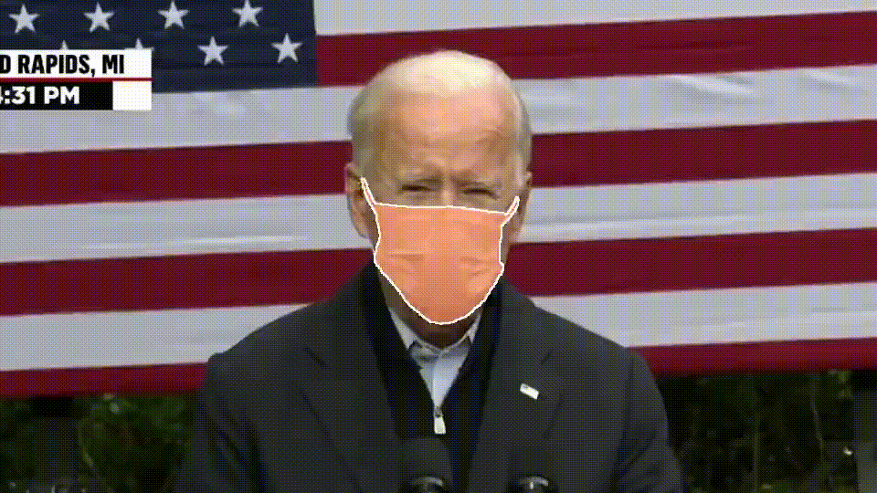

# TrackGPT: Track What You Need in Videos via Text Prompts

Inspired by [Track-Anything](https://github.com/gaomingqi/Track-Anything), TrackGPT allows users to detect and track objects in videos using text prompts. It is developed upon [GroundingDINO](https://github.com/IDEA-Research/GroundingDINO), [DetGPT](https://github.com/OptimalScale/DetGPT), [Segment Anything](https://github.com/facebookresearch/segment-anything) and [XMem](https://github.com/hkchengrex/XMem). By leveraging the capabilities of DetGPT, TrackGPT is able to interpret user instructions in natural language to segment objects of interest in video frames. Users input a text instruction, and TrackGPT intelligently finds and tracks the specified object throughout the video.

## **News**

- [2023-05-15] We made TrackGPT public!

## Example:

1. Text prompt: What did Biden do to protect his health?

2. Text prompt: I want to track elon.

3. Text prompt: Help me focus on the man playing basketball.

## Setup

In order to execute the code, it is required to have a minimum of either one 40GB GPU or two 32GB GPUs.

This section is to be done.

## License
This repository is released under [BSD 3-Clause License](LICENSE.md).
